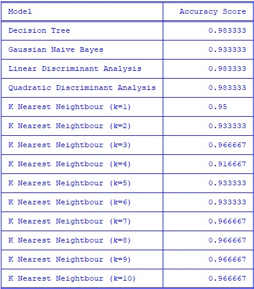
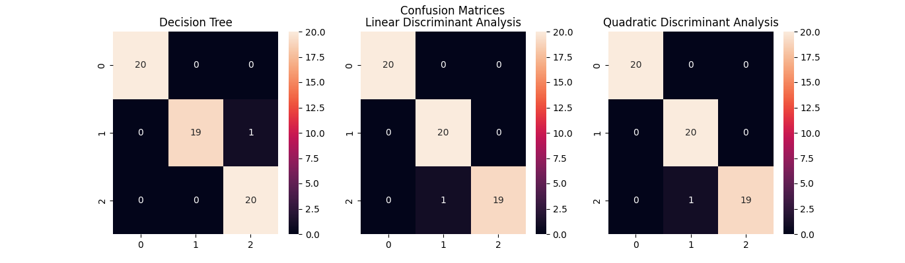

# iris-classification
Using database of iris flowers, creates multiple models to predict species of iris.

### NOV2022

## The Dataset

#### A database of iris characteristcs was downloaded from the link below. The dataset contains length and width measurements of the petals and sepals from three species of irises.

https://archive.ics.uci.edu/ml/datasets/iris

## Classification using Scikit-learn

#### The following blog was used as reference when training the model.

https://towardsdatascience.com/exploring-classifiers-with-python-scikit-learn-iris-dataset-2bcb490d2e1b

#### The dataset was downloaded locally on my computer from the link above. 

#### The following classification models were used to train the data:
*  Decision Tree
* Gaussian Naive Bayes
* Linear Discriminant Analysis
* Quadratic Discriminant Analysis 
* K Nearest Neighbour

#### The accuracy score of each corresponding model can be found in the table below.

## Checking Accuracy

#### As seen in the table above, the models with the highest accuracy scores are the Decision Tree, Linear Discriminant Analysis, and Quadratics Discriminant Analysis. To further look that these models, a confusion matrix was created for each model as seen below. 

